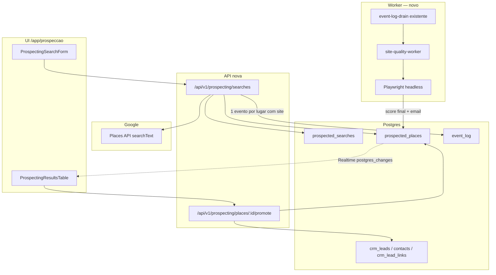

# Prospecção via Google Maps (Design)

**Spec:** `.specs/features/prospeccao-google-maps/spec.md`
**Status:** Draft

---

## Architecture Overview

Dois relógios, como na doutrina de `event_log` já estabelecida:

| | Busca (P1) | Análise de site (P2) |
| --- | --- | --- |
| Disparo | Clique do operador | Automático, um por resultado com site, ao final da busca |
| Onde roda | Dentro da própria request (rápido: só a Places API) | Fora da request, worker drenando `event_log` |
| Falha | Erro visível na hora, nada persiste | Isolada por linha (`site_analysis_status='failed'`), resto da busca intacto |



`Searches` responde assim que a Places API volta — nunca espera o Playwright. `site-quality-worker` é um handler novo registrado no dispatcher existente (`lib/event-log/dispatcher`), drenado pelo cron `event-log-drain` que já existe (mesmo padrão de `media-persist`, `rag-indexer` etc.) — **não** cria um cron novo.

---

## Code Reuse Analysis

### Existing Components to Leverage

| Component | Location | How to Use |
| --- | --- | --- |
| Auth + org + role | `lib/auth/server.ts` (`requireAuth`, `resolveActiveOrg`), `lib/auth/require-role.ts` | Guard da página e das rotas; `requireRole('manager')` (busca custa API, promoção muta o funil) |
| RLS multi-tenant | Padrão `tenant_isolation_<tabela>_all` via `fn_user_org_ids()` | Mesma policy nas 2 tabelas novas |
| API wrappers | `lib/api/wrappers.ts` (`ok()`/`fail()`), `lib/schemas/*` (Zod) | Todas as rotas novas seguem o contrato existente |
| Audit | helper de `audit()` já usado em outras rotas de mutação | Emitir em busca disparada e em promoção |
| `event_log` + dispatcher | `docs/specs/07-spec-events-workers.md`, `workers/*.handler.ts` | Novo handler `site-quality-worker.handler.ts`, mesmo formato de `media-persist-worker.handler.ts` |
| Promoção determinística | `lib/leads/nascimento-do-lead.ts` | Mesma função de "achar pipeline default + etapa de menor position"; motivos de não-criação tipados do mesmo jeito |
| `crm_lead_links` | `target_kind` já aceita `'external'` no CHECK | Linka `crm_leads` de volta para `prospected_places.id`, sem mudar schema dessa tabela |
| URL estável de lead | `app/app/leads/[id]/page.tsx` | Destino do link da coluna de observação (P4) — não inventar rota nova |
| Realtime | Padrão `postgres_changes` já usado em inbox/kanban | Assinar updates de `prospected_places` filtrado por `search_id` |
| Client Supabase admin | `lib/supabase/admin.ts` | Usado pelo worker (roda fora de request de usuário); filtro de `organization_id` manual e explícito, nunca vindo de payload externo sem checagem |
| Docker do worker | `Dockerfile.worker` (separado da imagem da app) | Instalar Chromium aqui, não na imagem principal |

### Integration Points

| System | Integration Method |
| --- | --- |
| Google Places API | `lib/prospecting/places-client.ts`, chamada server-side só (nunca do client — a key não pode vazar pro browser) |
| `event_log` drain | Inalterado — só um handler novo registrado |
| CRM (contacts/crm_leads/crm_lead_links) | Reaproveita `nascimento-do-lead.ts` como referência de implementação, não importa ele direto (domínio de origem diferente: conversa vs. prospecção) |
| Realtime | Cliente browser assina `prospected_places` filtrado por `organization_id` (RLS cobre) e `search_id` |

### CONCERNS

Ponto frágil novo, não presente no resto do repo: **Playwright nunca rodou em produção aqui.** Duas coisas exigidas antes de T-tasks de worker: (1) `playwright` (ou `playwright-core` + `chromium`) precisa sair de `devDependencies` e entrar como dependência da imagem do worker; (2) `Dockerfile.worker` precisa instalar os binários do Chromium (`npx playwright install --with-deps chromium` ou base image com Chromium já presente) — sem isso o worker crasha em produção mesmo com código correto. Tratar timeout (15s) e erro de navegação como **falha esperada e comum** (sites de terceiros, fora do nosso controle) — nunca deixar uma exceção não tratada matar o worker inteiro (um lugar com site instável não pode travar a fila dos outros).

---

## Components

### `lib/prospecting/places-client.ts`

- **Purpose:** Encapsula a Google Places API (New) — `searchText`, paginação até 60 resultados.
- **Interfaces:** `searchPlaces(query: { businessType: string; location: string }): Promise<RawPlace[]>` — internamente pagina 3x (20+20+20) respeitando o delay exigido pelo `pageToken` antes de aceitá-lo como válido.
- **Dependencies:** `GOOGLE_PLACES_API_KEY` (env, server-only), field mask explícito (só os campos usados: `id, displayName, formattedAddress, nationalPhoneNumber, websiteUri, rating, userRatingCount`) — necessário na New API tanto por custo (SKU varia por campo pedido) quanto por doutrina de não pedir mais dado do que se usa.
- **Reuses:** Nenhum client existente faz isso; é 100% novo.

### `lib/prospecting/score.ts`

- **Purpose:** Fórmula pura de score — mesma doutrina de `lib/leads/score-formula.ts` ("é fórmula, não IA", auditável).
- **Interfaces:**
  - `scoreInitial(place: { hasWebsite: boolean; rating?: number; reviewCount?: number }): { score: number; label: 'quente'|'oportunidade'|'baixa' }`
  - `scoreFinal(place: { ...scoreInitial inputs, siteAnalysis: { reachable: boolean; mobileResponsive?: boolean; loadTimeMs?: number } }): { score: number; label: ... }`
- **Regras (mesmas do spec, explícitas aqui para não ficar tácito no código):**
  - Sem site → base 90.
  - Site inalcançável/timeout (`reachable=false`) → base 85 (pior que ter site bom, quase como não ter).
  - Site alcançável mas não responsivo OU `loadTimeMs > 3000` → base 55.
  - Site alcançável, responsivo, rápido → base 20.
  - Ajuste (soma-se ao base, depois clamp 0-100): `+10` se `rating>=4.5 && reviewCount>=20`; `+5` se `rating>=4.0`; `-10` se `reviewCount<5`.
  - Rótulo: `score>=70` Quente, `40<=score<70` Oportunidade, `score<40` Baixa.
- **Dependencies:** Nenhuma (função pura).
- **Reuses:** Ideia/doutrina de `score-formula.ts`; schema de dados próprio (domínios diferentes).

### `lib/prospecting/promote.ts`

- **Purpose:** Promove uma linha de `prospected_places` para `contacts` + `crm_leads` + `crm_lead_links`.
- **Interfaces:** `promoteToLead(admin, organizationId, placeId): Promise<{ leadId: string } | { error: MotivoSemPromocao }>` — motivos tipados (`ja_promovido`, `sem_pipeline_default`, `sem_etapa`, `erro`), mesmo espírito de `MotivoSemLead` em `nascimento-do-lead.ts`.
- **Dependencies:** `crm_pipelines.is_default`, `crm_stages` (menor `position`), `lib/supabase/admin.ts`.
- **Reuses:** Padrão de `nascimento-do-lead.ts` (não importa a função, replica a lógica no domínio de prospecção — fontes de dado de entrada são diferentes: contato+conversa vs. resultado bruto de Maps).

### `workers/prospecting-site-quality-worker.ts` + `.handler.ts`

- **Purpose:** Consome `prospected_place.site_quality_requested`, roda Playwright, chama `scoreFinal`, persiste.
- **Interfaces:** `handle(event): Promise<void>` — abre o site (timeout 15s), mede tempo de resposta, checa meta viewport (proxy simples de "responsivo"), procura `mailto:` no HTML, atualiza a linha (`site_analysis_status='done'|'failed'`, `score_final`, `email`, `site_analysis_result` jsonb).
- **Dependencies:** `playwright` (chromium), `lib/supabase/admin.ts`.
- **Reuses:** Formato de `workers/media-persist-worker.handler.ts` (par lógica + registro no dispatcher).

### `app/app/prospeccao/page.tsx` + `[searchId]/page.tsx`

- **Purpose:** Tela nova, padrão idêntico a `app/app/radar/page.tsx` — Server Component, `requireAuth()` + `resolveActiveOrg()` + `requireRole('manager')`, UI real em Client Component (`_components/`).
- **Reuses:** `requireRole` (já existe, usado em outras telas restritas), layout/guard herdado de `app/app/layout.tsx` automaticamente.

### `app/app/prospeccao/_components/ProspectingResultsTable.tsx`

- **Purpose:** Tabela paginada (15/15) com assinatura Realtime em `prospected_places` (filtro `search_id`), botões WhatsApp/exportar/promover, coluna de observação com link (`/app/leads/[id]`) quando `promoted_lead_id` não é nulo.
- **Reuses:** Padrão de assinatura Realtime já usado em inbox/kanban (mesmo hook/abordagem, não reinventar).

### API

- `POST /api/v1/prospecting/searches` — Zod valida `{ businessType, location, serviceType }` → `requireRole('manager')` → `resolveActiveOrg()` → `places-client.searchPlaces` → `score.scoreInitial` por linha → insere `prospected_searches` + `prospected_places` em lote → para cada linha com `website_url`, insere em `event_log` (`event_type='prospected_place.site_quality_requested'`, `external_id=prospected_places.id` para idempotência) → `audit()` → `ok()`.
- `GET /api/v1/prospecting/searches` — histórico (lista).
- `GET /api/v1/prospecting/searches/[id]` — reabre uma busca persistida (também serve de fallback se Realtime cair: client pode dar poll nela).
- `POST /api/v1/prospecting/places/[id]/promote` — chama `promote.ts`, `audit()`, retorna `leadId`.
- `POST /api/v1/prospecting/places/[id]/reanalyze` — só aceito quando `site_analysis_status='failed'`; reemite o evento (mesma idempotência por `external_id`, mas permite retry porque o status não é mais `pending`/`processing`).

---

## Data Models

```sql
create table public.prospected_searches (
  id uuid primary key default gen_random_uuid(),
  organization_id uuid not null references public.organizations(id),
  business_type text not null,
  location text not null,
  service_type text not null default 'venda_de_site',
  requested_by uuid not null references auth.users(id),
  result_count integer not null default 0,
  places_api_capped boolean not null default false, -- true quando bateu no teto de 60
  created_at timestamptz not null default now()
);

create table public.prospected_places (
  id uuid primary key default gen_random_uuid(),
  search_id uuid not null references public.prospected_searches(id) on delete cascade,
  organization_id uuid not null references public.organizations(id), -- denormalizado, mesmo padrão de crm_leads
  place_id text not null, -- id da Google (Places API)
  name text not null,
  address text,
  phone_number text,
  phone_number_normalized text, -- E.164, para o link wa.me
  website_url text,
  rating numeric,
  review_count integer,
  score_initial integer not null,
  score_final integer, -- null até P2 terminar (ou até sempre, se não há site)
  status_label text not null, -- 'quente' | 'oportunidade' | 'baixa', recalculado quando score_final chega
  site_analysis_status text not null default 'not_applicable', -- 'not_applicable' | 'pending' | 'processing' | 'done' | 'failed'
  site_analysis_result jsonb, -- { reachable, mobileResponsive, loadTimeMs, error? }
  email text,
  promoted_lead_id uuid references public.crm_leads(id),
  promoted_at timestamptz,
  created_at timestamptz not null default now(),
  updated_at timestamptz not null default now(),
  unique (organization_id, search_id, place_id)
);

alter table public.prospected_searches enable row level security;
alter table public.prospected_places enable row level security;

create policy tenant_isolation_prospected_searches_all on public.prospected_searches
  using (organization_id in (select fn_user_org_ids()));
create policy tenant_isolation_prospected_places_all on public.prospected_places
  using (organization_id in (select fn_user_org_ids()));
```

```typescript
type SiteAnalysisStatus = "not_applicable" | "pending" | "processing" | "done" | "failed";
type StatusLabel = "quente" | "oportunidade" | "baixa";

interface ProspectedPlace {
  id: string;
  searchId: string;
  placeId: string;
  name: string;
  address: string | null;
  phoneNumber: string | null;
  phoneNumberNormalized: string | null;
  websiteUrl: string | null;
  rating: number | null;
  reviewCount: number | null;
  scoreInitial: number;
  scoreFinal: number | null;
  statusLabel: StatusLabel;
  siteAnalysisStatus: SiteAnalysisStatus;
  siteAnalysisResult: { reachable: boolean; mobileResponsive?: boolean; loadTimeMs?: number; error?: string } | null;
  email: string | null;
  promotedLeadId: string | null;
  promotedAt: string | null;
}
```

**Relationships:** 1 `prospected_searches` : N `prospected_places`. 1 `prospected_places` : 0..1 `crm_leads` (via `promoted_lead_id`, e reforçado por um `crm_lead_links` com `target_kind='external'` apontando de volta). Nenhuma FK de `crm_leads`/`contacts` para `prospected_places` além desse link — a tabela de prospecção nunca é lida pelo motor do CRM, só pela própria tela de prospecção.

**Nota DIRC:** `status_label` e `score_final` são armazenados (não calculados a cada leitura) porque mudam de forma assíncrona e a UI precisa refletir o valor **no momento em que o worker terminou**, não recalcular em cada render — decisão consciente de "Duplicar" em vez de "Calcular" nesse caso específico.

---

## Error Handling Strategy

| Error Scenario | Handling | User Impact |
| --- | --- | --- |
| Places API sem billing / key inválida | 4xx com `code` específico (`places_api_misconfigured`) | Mensagem acionável, não genérica |
| Places API zero resultados | 200 com lista vazia | Estado vazio explicado na UI |
| Busca já no teto de 60 | `places_api_capped=true` na resposta | UI explica o teto, sem botão de "carregar mais" |
| Site inalcançável/timeout no worker (P2) | `site_analysis_status='failed'`, erro em `site_analysis_result.error` | Linha mostra "não foi possível analisar" + botão de tentar de novo; score permanece o inicial |
| Erro inesperado no worker (não timeout) | Mesmo tratamento de `failed` — nunca deixa exceção subir e matar o worker | Idem acima |
| Segunda análise pedida com uma já em andamento | Idempotência por `external_id` no `event_log` (`unique(organization_id, external_id)`, captura `23505`) | Nenhum job duplicado; UI já mostra "analisando" |
| Promoção de linha já promovida | 409 `already_promoted` | Botão de promover já aparece desabilitado/trocado por link |
| Tenant B tentando acessar busca/lugar do tenant A | RLS bloqueia (0 linhas) | 404 (mesmo padrão de `app/app/leads/[id]`: não revelar diferença entre "não existe" e "não é seu") |

---

## Tech Decisions

| Decision | Choice | Rationale |
| --- | --- | --- |
| Versão da Places API | New (`searchText`), não legacy | Caminho atualmente recomendado pela Google; teto de 60 é o mesmo nas duas |
| Field mask explícito | Só os 7 campos usados | Custo de API varia por campo pedido na New API; doutrina de não requisitar o que não se usa |
| Tabelas novas vs. estender `contacts`/`crm_leads` | Tabelas novas (`prospected_searches`/`prospected_places`) | Doutrina DIRC: entidade diferente (empresa vs. pessoa física), ciclo de vida diferente (resultado bruto vs. oportunidade em funil) — ver justificativa completa na exploração que embasou o spec |
| RBAC | `requireRole('manager')` para buscar e promover | Busca custa API paga; promoção muta o funil. v1 não tem RBAC fino (fora de escopo do spec), mas precisa de algum gate — `manager+` é o mais próximo do "só o Thiago" hoje |
| Playwright em produção | Sim, só no worker (`Dockerfile.worker`), nunca em rota HTTP | Doutrina "trigger nunca faz HTTP" / efeito colateral pesado sempre assíncrono |
| Notificação de resultado assíncrono na UI | Supabase Realtime (`postgres_changes`) | Já é o padrão usado em inbox/kanban; evita reinventar polling |
| Retry de análise de site | Endpoint dedicado, só quando `status='failed'` | Sem isso, uma falha de site fica permanente sem ação possível do operador |
| E-mail | Só extraído do HTML do site (`mailto:`/regex simples) | Places API não fornece; não vale scraping mais agressivo (fora de escopo) |

---

## Test strategy

| Layer | Gate | Parallel-safe |
| --- | --- | --- |
| `lib/prospecting/score.ts` | `pnpm exec vitest run lib/prospecting/score.test.ts` (função pura, tabela de casos) | Yes |
| `lib/prospecting/places-client.ts` | Unit com fetch mockado (paginação, teto de 60, erro de key) | Yes |
| `lib/prospecting/promote.ts` | Unit com Supabase mockado (reaproveita contato existente, pipeline default, já promovido) | Yes |
| Rotas `app/api/v1/prospecting/*` | Unit de schema/handler | Yes |
| RLS das 2 tabelas novas | `pnpm test:db` (isolamento cross-tenant) | No (Docker Postgres) |
| `prospecting-site-quality-worker` | Unit com Playwright mockado (sucesso, timeout, erro) + integração real contra um site de teste local | Yes (unit) / No (integração real) |
| UI (`/app/prospeccao`) | `pnpm test:e2e` — busca → ver resultados → aguardar análise (mock) → promover → conferir link pro lead | No |

---

## Pré-requisitos de infraestrutura (fora do código desta feature)

- `GOOGLE_PLACES_API_KEY` com Places API (New) habilitada e billing ativo no Google Cloud — Thiago precisa criar/configurar (não posso fazer isso por ele).
- `Dockerfile.worker` atualizado para instalar Chromium do Playwright — muda a imagem de produção do worker, deploy exige o cuidado de sempre ("pode subir" explícito).
