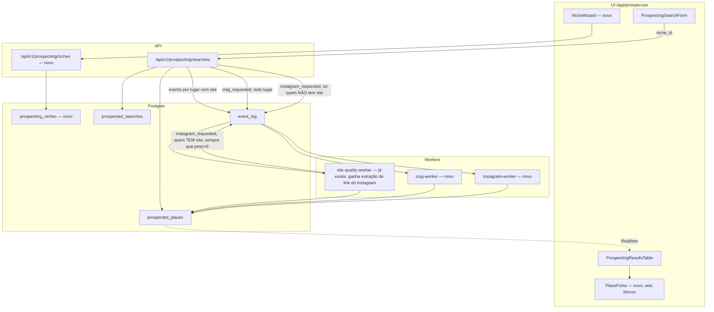

# Prospecção — Nichos configuráveis e enriquecimento (Design)

**Spec:** `.specs/features/prospeccao-nichos-e-enriquecimento/spec.md`
**Status:** Draft

---

## Architecture Overview

Quatro relógios agora, não dois — P1 (busca) continua síncrono; P2 (site, já existente) e os dois novos (CNPJ, Instagram) são assíncronos, cada um seu próprio worker, mesma doutrina de `event_log`:

| | Busca (P1) | Site (P2, já existe) | CNPJ (novo) | Instagram (novo) |
| --- | --- | --- | --- | --- |
| Disparo | Clique do operador, exige nicho escolhido | Automático, 1 por resultado com site | Automático, 1 por resultado (não depende de site) | Automático quando o nicho dá peso > 0 a esse sinal — direto da busca se não tem site; depois do site-quality-worker terminar se tem (pra aproveitar o link, se achou) |
| Onde roda | Dentro da request (Places API) | Worker, Playwright | Worker, chamada HTTP à Receita | Worker, chamada Apify |
| Falha | Erro visível na hora | Isolada por linha (`site_analysis_status='failed'`) | Isolada por linha (`cnpj_status='failed'`) | Isolada por linha (`instagram_status='failed'`) |



`site-quality-worker` ganha uma responsabilidade nova (extrair link de Instagram do HTML, mesmo regex simples já usado pro `mailto:`) mas continua um worker só — não vira um "worker de tudo". CNPJ dispara direto da rota de busca pra todo resultado (não depende de site). Instagram tem dois caminhos, os dois resolvidos dentro do `instagram-worker`, nunca duplicando o fetch do site: resultado **sem** site dispara direto da busca; resultado **com** site é **encadeado** pelo `site-quality-worker` ao terminar (aproveita o HTML já baixado pra tentar achar o link primeiro). Em ambos os casos, se não houver link (ou não houver site), o `instagram-worker` cai pra uma pesquisa no Google — mesma etapa que o kit chama de "pesquisa", pelo mesmo ator do Apify que o kit usa por padrão quando só há `APIFY_TOKEN` (`apify~google-search-scraper`), sem Serper.

---

## Code Reuse Analysis

### Existing Components to Leverage

| Component | Location | How to Use |
| --- | --- | --- |
| Auth + org + role | `lib/auth/server.ts`, `lib/auth/require-role.ts` | Mesmo guard (`requireRole('manager')`) nas rotas novas de nicho e na busca |
| RLS multi-tenant | Padrão `tenant_isolation_<tabela>_all` via `fn_user_org_ids()` | Mesma policy em `prospecting_niches` |
| API wrappers + Zod | `lib/api/wrappers.ts`, `lib/schemas/prospecting.ts` | `prospectingSearchSchema` troca `serviceType: z.literal(...)` por `nicheId: z.string().uuid()`; novo `prospectingNicheSchema` |
| `event_log` + dispatcher | `lib/event-log/register-handlers.ts`, `workers/*.handler.ts` | Dois handlers novos (`cnpj-worker.handler.ts`, `instagram-worker.handler.ts`), registrados do mesmo jeito que `site-quality-worker` |
| Guarda de idempotência por aplicação | `workers/prospecting-site-quality-worker.ts` linhas 200-222 (claim otimista por `UPDATE ... WHERE status = status_lido`) | **Copiar este padrão exato** nos dois workers novos — `event_log` real não tem `external_id`/constraint de idempotência (achado confirmado na feature anterior, não é suposição de design desta vez) |
| `STATUS_META` / Badge / Card | `ProspectingResultsTable.tsx` | Mesmo padrão de cor por variante (`success`/`warning`/`neutral`) estendido pros blocos da ficha nova |
| Realtime | Hook já usado em `ProspectingResultsTable.tsx` | Mesma assinatura, cobre as colunas novas automaticamente (publica a tabela inteira, não por coluna) |
| Client Supabase admin | `lib/supabase/admin.ts` | Usado pelos dois workers novos, filtro de `organization_id` manual |

### Integration Points

| System | Integration Method |
| --- | --- |
| Apify (Instagram) | `lib/prospecting/apify-client.ts` — novo, mesmo espírito de `places-client.ts` (server-only, token nunca chega ao browser) |
| Receita Federal (CNPJ) | `lib/prospecting/receita-client.ts` — novo, consulta pública por nome + valida CEP contra `prospected_places.address` |
| `event_log` drain | Inalterado — dois handlers novos registrados |
| Realtime | Inalterado — já cobre a tabela inteira |

### CONCERNS

O `site-quality-worker` existente ganha uma responsabilidade nova (achar link de Instagram) e um side effect novo (emitir evento pro `instagram-worker`) — isso o torna um pouco mais do que "só qualidade de site". Alternativa considerada: um worker à parte só pra extrair o link, disparado no mesmo evento que o site-quality. Rejeitada por YAGNI — o link do Instagram só existe se o HTML já foi baixado, e o `site-quality-worker` já baixa esse HTML; duplicar o fetch só pra manter separação "pura" custaria uma chamada HTTP extra por resultado sem ganho real. Documentar isso explicitamente no arquivo do worker (mesmo estilo de comentário que já existe lá sobre a idempotência) quando a task acontecer.

**Paridade com o kit, confirmada:** o `prospeccao-kit-aluno` acha Instagram/CNPJ mesmo quando o site não linka, via uma etapa de "pesquisa no Google" (`lib/pesquisa.mjs` do kit) — conferido no código do kit: o caminho **padrão**, quando só há `APIFY_TOKEN` configurado (o nosso caso, decisão já tomada de não usar Serper/Places), é o ator `apify~google-search-scraper`, não um provedor novo. Esta feature replica essa etapa (`lib/prospecting/pesquisa-client.ts`, ver Components), então não há diferença de cobertura em relação ao kit — só a arquitetura de onde a chamada mora (worker + `event_log`, aqui; função síncrona chamada pelo `prospectar.mjs`, lá).

---

## Components

### `supabase/migrations/…_0236_prospeccao_nichos.sql`

- Cria `prospecting_niches`.
- Adiciona `prospected_searches.niche_id` (FK, not null) e mantém `service_type` como cópia denormalizada do `service_type` do nicho **no momento da busca** (não um join ao vivo) — é o que já faz uma busca antiga não mudar quando o nicho é editado depois, sem precisar duplicar pesos/requisitos inteiros na busca.
- Adiciona `prospected_places.requisitos_ok boolean not null default true` e `motivo_requisitos text` — mesmo nome de campo do kit (`requisitos_ok`/`motivo_requisitos` em `sql/003-site-e-requisitos.sql`), de propósito, pra quem leu o kit reconhecer.

### `supabase/migrations/…_0237_prospeccao_enriquecimento.sql`

- Adiciona em `prospected_places`: `cnpj_data jsonb`, `cnpj_status text not null default 'not_applicable'` (+ CHECK, mesmos 5 valores de `site_analysis_status`), `cnpj_consultado_em timestamptz`, `instagram_data jsonb`, `instagram_status text not null default 'not_applicable'` (+ mesmo CHECK), `instagram_consultado_em timestamptz`.

### `lib/prospecting/score.ts` (refatorado)

- **Purpose:** deixa de ter constantes hardcoded; passa a receber os pesos/requisitos do nicho como parâmetro.
- **Interfaces novas:**
  - `type NicheWeights = { site: number; instagram: number; whatsapp: number; email: number; telefone: number; reputacao: number; cnpj: number; endereco: number; linkedin: number }` (soma 100, validada na escrita do nicho, não aqui)
  - `type NicheRequirements = { avaliacoesMin?: number; avaliacoesMax?: number; exigeCelular?: boolean; exigeSite?: boolean }`
  - `scoreInitial(place, weights: NicheWeights): ScoreResult` — mesma lógica de base (sem site/com site) e ajuste de rating, agora ponderada pelo peso de `site` do nicho em vez da constante fixa.
  - `scoreFinal(place, siteAnalysis, weights: NicheWeights): ScoreResult` — idem, incorporando também os pesos de instagram/cnpj quando esses dados já chegaram (chamada de novo depois que CNPJ/Instagram terminam, não só depois do site).
  - `checkRequirements(place, requirements: NicheRequirements): { ok: boolean; motivo?: string }` — nova função, separada do score (mesma distinção do kit entre nota e aderência).
- **Compatibilidade:** os testes de limite existentes (`labelFromScore`, os três rótulos) continuam valendo — só o cálculo do "base" muda de constante pra ponderado. `labelFromScore` não muda de assinatura.
- **Reuses:** doutrina de `lib/leads/score-formula.ts` ("fórmula, não IA") continua valendo — agora com parâmetro em vez de constante, ainda sem I/O.

### `lib/prospecting/apify-client.ts` (novo)

- **Purpose:** encapsula a leitura de um perfil de Instagram via Apify (mesmo ator usado no kit).
- **Interfaces:** `readInstagramProfile(username: string): Promise<{ seguidores, posts, diasSemPostar, engajamentoMedio } | { erro: string }>`.
- **Dependencies:** `APIFY_TOKEN` (env, server-only, novo).

### `lib/prospecting/receita-client.ts` (novo)

- **Purpose:** consulta CNPJ por nome de empresa, valida por CEP.
- **Interfaces:** `lookupCnpj(nomeEmpresa: string, cepEsperado: string): Promise<{ razaoSocial, socioAdministrador, abertura, porte, cnpj } | { motivo: string }>` — descarta e devolve `motivo` quando nenhum CEP bate, mesma regra do kit.
- **Dependencies:** nenhuma (endpoint público da Receita).

### `lib/prospecting/pesquisa-client.ts` (novo)

- **Purpose:** réplica de `lib/pesquisa.mjs` do kit — pesquisa no Google pelo que faltou (perfil de Instagram, CNPJ) via Apify, sem Serper.
- **Interfaces:** `pesquisarGoogle(termos: string[]): Promise<Map<string, { titulo, link, trecho }[]>>` — chama o ator `apify~google-search-scraper` (`POST /v2/acts/apify~google-search-scraper/run-sync-get-dataset-items`), mesmo endpoint que o kit usa.
- **Regras replicadas do kit:** até 3 tentativas por busca, formatos diferentes; link só aceito se vier do próprio resultado da busca (nunca inventado); domínios que não são "o site da empresa" (redes sociais, diretórios, marketplaces) ficam de fora de quem conta como "site achado" — a mesma lista de `NAO_E_SITE` do kit.
- **Dependencies:** `APIFY_TOKEN` (mesma chave do `apify-client.ts`).

### `workers/prospecting-cnpj-worker.ts` + `.handler.ts` (novo)

- **Purpose:** consome `prospected_place.cnpj_requested`. Tenta `receita-client` pelo nome direto; se o CEP não bate ou não achou nada, usa `pesquisa-client` pra achar um candidato (nome + "CNPJ") e tenta de novo — mesma cascata do `cnpj.mjs` do kit.
- **Idempotência:** mesmo guard de claim otimista do `site-quality-worker` (`cnpj_status` como coluna de estado).
- **Reuses:** formato exato de `prospecting-site-quality-worker.ts` — mesma estrutura de arquivo, trocando Playwright por chamadas HTTP simples.

### `workers/prospecting-instagram-worker.ts` + `.handler.ts` (novo)

- **Purpose:** consome `prospected_place.instagram_requested`. Se o evento já traz um link de Instagram (achado pelo `site-quality-worker`), valida e lê direto via `apify-client`. Sem link (sem site, ou site não linkou), usa `pesquisa-client` pra achar um candidato, valida (perfil com a marca no @, no nome ou na bio — mesma regra do kit, descarta perfil genérico) e só então lê. Sem candidato válido, grava `instagram_status='done'`, `instagram_data=null` e o motivo — "não encontrado" não é falha.
- **Idempotência:** mesmo guard (`instagram_status`).

### `workers/prospecting-site-quality-worker.ts` (estendido)

- Ganha: regex de link de Instagram no HTML (mesmo padrão do `mailto:` já existente, achado "de graça" no mesmo fetch). Ao terminar, emite `prospected_place.instagram_requested` sempre que `weights.instagram > 0` (lido do nicho da busca) — achou link ou não, quem decide o que fazer com isso é o `instagram-worker`.

### `app/app/prospeccao/nichos/page.tsx` + `_components/NicheWizard.tsx` (novo)

- **Purpose:** lista de nichos da organização + formulário guiado (passo a passo, mesmas perguntas de `MEU-CLIENTE-IDEAL.md` do kit) pra criar/editar.
- **Reuses:** `requireRole('manager')`, layout herdado de `app/app/layout.tsx`, componentes de formulário já usados em outras telas (`react-hook-form` + `@hookform/resolvers/zod`, já são dependências do projeto).

### `app/app/prospeccao/[searchId]/[placeId]/page.tsx` + `_components/PlaceFicha.tsx` (novo)

- **Purpose:** ficha de um resultado, seis blocos coloridos (Google/Instagram/Site/Receita/Contato/Venda), estado vazio por bloco quando a etapa não rodou — mesma disposição de `docs/o-painel.md` do kit, componentes do CRM (`Card`, `Badge`).
- **Reuses:** `STATUS_META` estendido com uma entrada de cor por bloco (não reinventa um sistema de cor novo).

### API

- `POST /api/v1/prospecting/niches` — cria nicho; Zod valida pesos somando 100.
- `GET /api/v1/prospecting/niches` — lista da organização.
- `PATCH /api/v1/prospecting/niches/[id]` — edita; não afeta buscas já feitas.
- `POST /api/v1/prospecting/searches` (alterado) — Zod valida `{ businessType, location, nicheId }`; busca o nicho, usa `weights`/`requirements` no lugar das constantes; emite `cnpj_requested` pra **todo** resultado, além do `site_quality_requested` já existente (só quem tem site); emite `instagram_requested` direto, aqui, só pra quem **não** tem site e `weights.instagram > 0` (quem tem site recebe esse evento depois, do `site-quality-worker`).

---

## Data Models

```sql
create table public.prospecting_niches (
  id uuid primary key default gen_random_uuid(),
  organization_id uuid not null references public.organizations(id) on delete cascade,
  name text not null,
  service_type text not null,
  search_terms text[] not null,
  requirements jsonb not null default '{}'::jsonb,
  weights jsonb not null default '{}'::jsonb,
  created_by uuid not null references auth.users(id),
  created_at timestamptz not null default now(),
  updated_at timestamptz not null default now()
);

alter table public.prospecting_niches enable row level security;
create policy tenant_isolation_prospecting_niches_all on public.prospecting_niches
  using (organization_id in (select fn_user_org_ids()))
  with check (organization_id in (select fn_user_org_ids()));

alter table public.prospected_searches
  add column niche_id uuid not null references public.prospecting_niches(id);
-- service_type já existe (0234); passa a ser cópia do nicho no momento da busca,
-- não mais literal fixo — a app deixa de mandar o mesmo valor sempre.

alter table public.prospected_places
  add column requisitos_ok boolean not null default true,
  add column motivo_requisitos text,
  add column cnpj_data jsonb,
  add column cnpj_status text not null default 'not_applicable',
  add column cnpj_consultado_em timestamptz,
  add column instagram_data jsonb,
  add column instagram_status text not null default 'not_applicable',
  add column instagram_consultado_em timestamptz,
  add constraint prospected_places_cnpj_status_check
    check (cnpj_status in ('not_applicable','pending','processing','done','failed')),
  add constraint prospected_places_instagram_status_check
    check (instagram_status in ('not_applicable','pending','processing','done','failed'));
```

```typescript
interface NicheWeights {
  site: number; instagram: number; whatsapp: number; email: number;
  telefone: number; reputacao: number; cnpj: number; endereco: number; linkedin: number;
}
interface NicheRequirements {
  avaliacoesMin?: number; avaliacoesMax?: number; exigeCelular?: boolean; exigeSite?: boolean;
}
interface ProspectingNiche {
  id: string; organizationId: string; name: string; serviceType: string;
  searchTerms: string[]; requirements: NicheRequirements; weights: NicheWeights;
}
```

**Relationships:** 1 `organizations` : N `prospecting_niches`. 1 `prospecting_niches` : N `prospected_searches` (via `niche_id`, sem cascade — apagar nicho com buscas vinculadas é bloqueado, ver Edge Cases do spec). `prospected_places` ganha três "trilhos" assíncronos independentes (site, cnpj, instagram), cada um com seu par status/dado/timestamp, mesmo formato dos três.

**Nota DIRC:** `requisitos_ok`/`motivo_requisitos` são armazenados, não recalculados a cada leitura — mesma razão de `status_label`: o requisito é avaliado uma vez, na busca, contra os dados que existiam naquele momento.

---

## Error Handling Strategy

| Error Scenario | Handling | User Impact |
| --- | --- | --- |
| Nicho com pesos que não somam 100 | 400 na escrita do nicho, `code='weights_not_100'` | Formulário mostra o total atual, bloqueia salvar |
| Busca sem nicho escolhido | 400, `code='niche_required'` | Botão de buscar desabilitado até escolher |
| Apify sem crédito/token inválido (Instagram) | `instagram_status='failed'`, motivo salvo | Bloco de Instagram na ficha mostra "não foi possível consultar" |
| Receita Federal indisponível ou CNPJ não encontrado | `cnpj_status='failed'` ou `'done'` com `cnpj_data=null` + motivo | Bloco de Receita mostra "não encontrado" (não é erro) |
| CEP da Receita não bate com o do Maps | `cnpj_status='done'`, `cnpj_data=null`, motivo explícito | Idem — mesma distinção "não achou" vs "achou e descartou" do kit |
| Segunda análise pedida com uma já em andamento (CNPJ ou Instagram) | Claim otimista por `UPDATE ... WHERE status = status_lido` (mesmo padrão do site-quality-worker) | Nenhum job duplicado |
| Apagar nicho com buscas vinculadas | 409, `code='niche_in_use'` | UI explica, sugere arquivar em vez de apagar (decisão de produto: nicho não tem "apagar" ainda, só criar/editar — apagar fica pra quando houver necessidade real) |

---

## Tech Decisions

| Decision | Choice | Rationale |
| --- | --- | --- |
| Nicho: 1 por organização ou N | N por organização, tabela própria | Confirmado com o Thiago — organização pode prospectar mais de um tipo de cliente ao mesmo tempo, igual ao kit |
| Provedor de dado | Só Apify (Maps continua Places API existente; Instagram novo é Apify) | Decisão tomada na conversa — não adicionar Google Places como segundo provedor de Instagram/busca; evita duas contas/dois modelos de custo pro mesmo tipo de dado |
| Onde mora o critério configurável | JSONB em `prospecting_niches.weights`/`requirements`, não uma DSL de regras | Mesma forma do kit (JSON por nicho), validada por 3 semanas de uso real; uma DSL seria overengineering pra esse volume de regras |
| Gatilho do Instagram | Direto da rota, se não tem site; encadeado pelo `site-quality-worker`, se tem | Sem site, não há por que esperar; com site, aproveita o HTML já baixado em vez de buscar de novo |
| Pesquisa de fallback (Instagram/CNPJ) | `lib/prospecting/pesquisa-client.ts`, ator Apify `google-search-scraper` (mesmo do kit, sem Serper) | Pedido explícito nesta conversa: replicar o kit exatamente. Confirmado no código do kit que esse é o caminho padrão quando só há `APIFY_TOKEN` — não é provedor novo, só uma etapa que faltava no design anterior |
| Gatilho do CNPJ | Direto da rota de busca, pra todo resultado | Não depende de site (busca é por nome+cidade); é grátis, não tem motivo pra esperar |
| Pular consulta com peso 0 | Só vale pro Instagram (pago via Apify — leitura de perfil e, quando precisa, a pesquisa no Google) | CNPJ é grátis (Receita pública + pesquisa quando precisa); não pular economiza nada, então sempre roda |
| Idempotência dos workers novos | Claim otimista por coluna de status (`UPDATE ... WHERE status = status_lido`), não `external_id` do `event_log` | `event_log` real não tem essa constraint — achado confirmado na feature anterior; copiar a solução que já funciona em produção, não repetir a suposição que já se provou errada |
| Ficha por resultado | Rota nova `[searchId]/[placeId]`, não modal/drawer | Mesma navegação do painel do kit (URL própria por empresa, compartilhável); um modal perderia isso |
| Reprovado nos requisitos | Coluna própria (`requisitos_ok`/`motivo_requisitos`), separada do `status_label` de score | Mesma distinção do kit — nota baixa e "não é do perfil" são informações diferentes; folder num rótulo só perderia a distinção |

---

## Test strategy

| Layer | Gate |
| --- | --- |
| Unit | `score.test.ts` reescrito pra receber `weights`/`requirements` como parâmetro (mesmos casos de limite, agora parametrizados); `checkRequirements.test.ts` novo; `receita-client.test.ts`, `apify-client.test.ts` e `pesquisa-client.test.ts` (mocks de rede, incluindo o caso "3 tentativas, não achou na terceira") |
| Invariantes | `tests/invariants/prospecting.test.ts` estendido — RLS de `prospecting_niches` prova isolamento cross-tenant, mesmo formato do que já existe pras outras duas tabelas |
| Unit workers | `prospecting-cnpj-worker.test.ts`, `prospecting-instagram-worker.test.ts` — mesmos cenários do `site-quality-worker.test.ts` (timeout, concorrência, falha isolada) |
| E2E | `tests/e2e/prospeccao.spec.ts` estendido — criar nicho pelo wizard → buscar com ele → abrir ficha → ver os seis blocos; mesma ressalva do original: Places/Apify/Receita mockados, não é teste de integração real com as APIs externas |

---

## Pré-requisitos de infraestrutura (fora do código desta feature)

- `APIFY_TOKEN` novo nas variáveis de ambiente do worker (produção e dev) — hoje só existe no `.env.local` do kit solto, precisa ser provisionado pro CRM.
- **Opcional, com default vazio (`z.string().optional().default("")`, mesmo padrão de `ANTHROPIC_API_KEY`/`OPENAI_API_KEY` em `lib/env.ts`)** — doutrina de self-host: instalação existente sem essa chave não pode quebrar. Sem `APIFY_TOKEN`: `instagram-worker` marca `instagram_status='not_applicable'` direto (sem tentar), sem falha; a UI do nicho avisa que o peso de Instagram fica sem efeito até a chave ser configurada, mas não bloqueia criar/usar o nicho.
- Nenhuma dependência nova de sistema operacional (ao contrário do Playwright/Chromium da feature anterior) — Apify e Receita são chamadas HTTP simples.

## Navegação (Sistema Vivo, item 14 do Definition of Done)

Duas telas novas, cada uma precisa de porta declarada em `lib/navigation/registry.ts` (grupo "Prospecção", junto da tela já existente) — nenhuma alcançável só por URL digitada:

- `/app/prospeccao/nichos` (T13)
- `/app/prospeccao/[searchId]/[placeId]` (T15) — rota com parâmetro; ver em `registry.ts` o padrão já usado por outras rotas dinâmicas (ex.: `/app/leads/[id]`) pra saber se entra como item de menu ou só como destino navegável (sem entrada de menu própria, já que se chega por ela clicando numa linha da tabela).

**Achado à parte, fora do escopo desta feature:** `/app/prospeccao` (a tela original) não aparece em `registry.ts` nem na allowlist de `tests/unit/navegacao-completude.test.ts` — dívida pré-existente, não introduzida aqui. Vale um item avulso pra investigar depois (por que o teste não pegou isso, e se a tela está mesmo alcançável só por URL).
